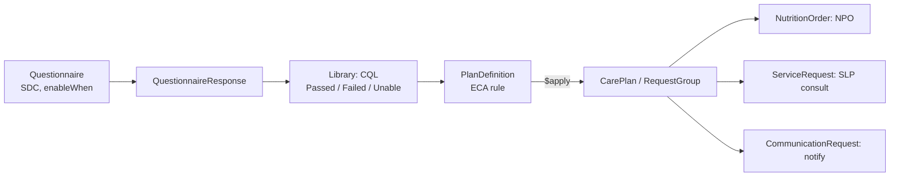

# Dysphagia screen as FHIR CDS (project 7)

A published bedside swallow screen encoded as a FHIR Questionnaire plus CQL logic that returns NPO + SLP consult, proceed with PO per order, or unable to screen — tested against edge-case fixtures on a local HAPI FHIR server. Your FHIR on-ramp before the handoff app. \~40 h.

## Clinical spec (write this first)

Paraphrase the Yale Swallow Protocol as the primary source, with BJH-SDS as the comparison, and cite both. Don't copy any form verbatim.

- **Source screens.** Yale Swallow Protocol (Suiter & Leder, 3-oz water swallow) as primary. Barnes-Jewish Hospital Stroke Dysphagia Screen (Edmiaston) as comparison. TOR-BSST is out (proprietary).
- **Guideline anchor.** The 2026 AHA/ASA acute ischemic stroke guideline (Stroke, DOI 10.1161/STR.0000000000000513) replaces the 2019 update. Pull its exact dysphagia-screening wording and class/level of evidence before citing — the research pass was blocked from the full text.
- **Measure anchor.** GWTG-Stroke AHASTR8: screen with an evidence-based bedside protocol before any food, fluids or medication by mouth. The Joint Commission retired its version (STK-7).

Draft decision table, for you to finalize against the source papers:

| Path | Condition (paraphrased) | Output |
| --- | --- | --- |
| Incomplete | Required answers missing | No recommendation; prompt to finish |
| Unable to screen | Fails pre-screen gates (alertness, upright positioning, other exclusions per your spec) | NPO including oral meds; notify provider; rescreen or SLP per spec |
| Fail | Pre-screen clear, but any failure sign on the water trial (can't complete, cough/choke, wet voice) | NPO including oral meds; SLP consult; notify provider |
| Pass | Completes the trial with no failure signs | Resume PO per provider diet order; document |

## FHIR artifacts

The nurse's answers flow through CQL into a PlanDefinition, and HAPI's `$apply` turns them into concrete orders and requests.

**Artifacts:**

- **Authoring:** write in FHIR Shorthand (FSH) and compile with SUSHI; IG Publisher is a stretch goal.
- **Questionnaire** (SDC IG): pre-screen items gate the water-trial items via `enableWhen`.
- **Terminology:** SNOMED CT 450819000 (On nothing by mouth status) and 40739000 (Dysphagia) — confirm both in the SNOMED browser. No standard LOINC panel for bedside swallow screens turned up. Search loinc.org first (free account); if none exists, define a local CodeSystem and cite the AJSLP 2025 paper on EHR swallow-screen variability as the rationale.
- **Library (CQL):** defines Screen Complete, Unable To Screen, Failed and Passed from the QuestionnaireResponse.
- **PlanDefinition + ActivityDefinitions:** NPO (NutritionOrder), SLP consult (ServiceRequest), provider notification (CommunicationRequest).

**Stack:**

- **CQL authoring:** VS Code with the CQL extension.
- **Compiling:** the cqframework cql-to-elm translator (Java/Maven) at build time.
- **Server:** local HAPI FHIR JPA server in Docker, using its built-in Clinical Reasoning module for `$apply`.
- **Rendering:** NLM's [LHC-Forms](https://lhncbc.github.io/lforms/) shows the Questionnaire in a static page.

Target whatever CQL version HAPI's engine supports: 1.5.x is widely deployed, and 2.0.0 is trial-use as of 2026. Don't link AHRQ CDS Connect as prior art — its repository is on hiatus.

## Build plan

1. **M1 (\~8 h):** clinical spec, decision table, citations, disclaimer ("educational re-implementation of published screening logic; not a certified clinical tool; not affiliated with the original authors").
2. **M2 (\~8 h):** Questionnaire in FSH, rendered in LHC-Forms.
3. **M3 (\~10 h):** CQL library, ELM compile, fixture tests.
4. **M4 (\~8 h):** PlanDefinition and ActivityDefinitions; `$apply` on local HAPI returns a CarePlan.
5. **M5 (\~6 h):** GitHub Actions CI (HAPI in Docker, all fixtures), README, demo GIF, write-up.

## Test fixtures

Use 12–15 QuestionnaireResponse fixtures, each with its expected CarePlan actions in a table. Assert them with JUnit, or with bash + curl + jq against the local server. Cover:

- a clean pass
- each failure sign on its own
- each pre-screen exclusion on its own
- an incomplete screen
- a contradictory response (trial answers present despite a failed gate)
- a rescreen after a prior fail
- a pass that lacks a diet order

## Stroke-workflow note for the README

The screen triggers on stroke alert or suspected-stroke admission, before any PO, meds included. Timing matters because GWTG tracks it. Link to project 13, which abstracts this same measure from charts.

**Résumé line:** "Encoded a published bedside dysphagia screen as FHIR R4 CDS (Questionnaire, CQL, PlanDefinition) running on HAPI FHIR with \[n\] automated test cases; mapped outputs to SNOMED CT and documented terminology gaps."
