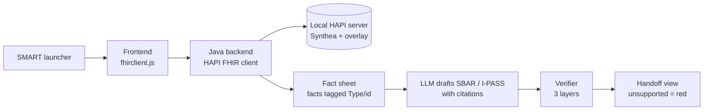

# Grounded SBAR / I-PASS handoff on SMART on FHIR (project 6)

A SMART on FHIR app that drafts an SBAR or I-PASS handoff from a synthetic patient, cites the FHIR resource behind every sentence, and flags anything a verifier can't support. This is the FHIR+AI project on your blueprint. \~60 h.

## Design

Every sentence of the handoff carries a resource ID, and a three-layer verifier decides whether that citation actually supports it.

**Data.** [Synthea](https://github.com/synthetichealth/synthea) (Apache-2.0, v4.0) generates US Core–conformant R4 patients, loaded into a local HAPI server. Synthea has no nursing flowsheet data, so you write a **nursing overlay** generator for:

- pain scores and intake/output
- fall-risk flags
- diet/NPO
- isolation
- lines and drains

Model these as Observations, Flags and NutritionOrders. Look codes up in LOINC/SNOMED and document each choice. The overlay is itself a portfolio point: it shows you know what's missing from generic EHR test data.

**Launch and servers:**

- **Launch:** the [SMART Health IT launcher](https://launch.smarthealthit.org/) (R4, no registration) simulates EHR launch.
- **Data:** your local HAPI server.
- **Smoke tests only:** hapi.fhir.org, which is purged regularly and had an outage in Feb 2026.
- **Stretch:** the Epic (fhir.epic.com) and Oracle Health sandboxes are free for developers. "Also runs against Epic's sandbox" is a strong README line.

**Architecture.** A static frontend uses [fhirclient.js](https://github.com/smart-on-fhir/client-js), which handles SMART OAuth for you; Java has no dedicated SMART client library. A Spring Boot backend pulls resources with the HAPI FHIR client and builds the fact sheet, calls the LLM, and runs the verifier. Resources pulled:

- Patient, Encounter, Condition, AllergyIntolerance
- MedicationRequest / MedicationAdministration
- Observation (vitals, labs, overlay)
- Procedure, CarePlan, DocumentReference

**Generation.** The output is JSON: `[{section, text, cites: ["Observation/abc", …]}]`.

- **SBAR** is the default (Kaiser origin, freely used).
- **I-PASS** is an option, citing Starmer, NEJM 2014; skip I-PASS Institute materials. The "Synthesis by receiver" step becomes a read-back checklist the app generates.

**Verifier:**

1. **Citation validity (deterministic):** every cited ID exists in the fetched bundle.
2. **Value fidelity (deterministic):** numbers, units, dates and drug names in the sentence match the cited resource.
3. **Support (LLM judge):** does the cited resource actually support the claim? Unsupported sentences go red, with an optional regenerate loop.

**Required-content checklist** (yours). Anything missing is flagged as an omission:

- allergies
- high-alert meds (anticoagulants, insulin)
- isolation
- fall risk
- lines/drains
- last vitals + trend
- pending labs
- tasks due next shift

**Standards touch.** Emit the finished handoff as a DocumentReference plus a Provenance record. The Provenance agent is a Device describing the model, and its entities are the source resources. This follows the HL7 AI Transparency on FHIR IG pattern (CI build, not yet published).

## Build plan

1. **M1 (\~10 h):** local HAPI in Docker, Synthea load, nursing overlay generator. Reuse the server setup from project 7.
2. **M2 (\~10 h):** SMART launch via the launcher; fetch and render the patient bundle.
3. **M3 (\~12 h):** fact sheet, LLM SBAR/I-PASS with citations, clickable-citation UI.
4. **M4 (\~13 h):** the three verifier layers, content checklist, highlighting.
5. **M5 (\~15 h):** evaluation, Provenance output, README, demo video, write-up.

## Evaluation

The headline is the unsupported-claim rate, measured with and without the verifier loop on 25 synthetic patients of varied complexity.

**Metrics:**

- citation validity %
- value-fidelity errors per handoff
- unsupported-claim rate (judge validated on your own labels)
- checklist omission rate
- your 1–5 usefulness and safety ratings, using a rubric adapted from Hartman et al., JAMA Network Open 2024

**Ablations:**

- citation requirement on vs off
- verifier regenerate loop on vs off
- two different models

**Prior art to read first:**

- Hartman et al. 2024: LLM-generated ED handoff notes. They beat physician notes on automated metrics but scored slightly lower on usefulness and safety.
- "Verifying Facts in Patient Care Documents Generated by LLMs Using EHRs" (NEJM AI, verify). This is the closest match to your mechanic.

**Standards note for the README.** ONC's HTI-1 baseline is US Core 6.1.0 (verify against the Federal Register text); the latest published version is 9.0.0. Saying which one you target, and why, reads as fluency.

**Résumé line:** "Built a SMART on FHIR app that drafts nursing handoffs (SBAR/I-PASS) with per-sentence FHIR resource citations and a 3-layer verifier; cut unsupported claims from \[x\]% to \[y\]% across \[n\] synthetic patients; outputs AI Provenance per the HL7 AI Transparency IG pattern."
