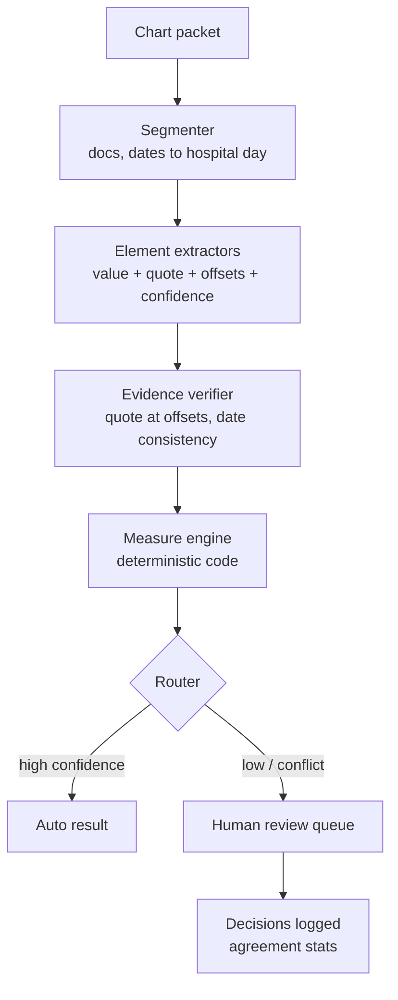

# Stroke measure abstraction agent (project 13)

A multi-agent pipeline that reads synthetic stroke charts, extracts measure data elements with verbatim evidence spans, lets deterministic code compute the measures, and routes shaky cases to a human review queue. Capstone; reuses NurseBench's case generator. \~70 h.

## Measure scope

v1 abstracts four Joint Commission stroke measures plus GWTG's dysphagia measure. The current Joint Commission set ([Specs Manual v2026A1](https://manual.jointcommission.org/releases/TJC2026A1/Stroke.html), free online) is STK-1 through STK-6, STK-8 and STK-10. Dysphagia screening (old STK-7) and door-to-needle live in GWTG-Stroke.

| Measure | Owner | eCQM twin | What the agent must find (paraphrase exact element names from the manual) |
| --- | --- | --- | --- |
| STK-2 Discharged on antithrombotic therapy | Joint Commission | CMS104 | Stroke type; discharge antithrombotic or a documented reason not given; exclusions (comfort measures only, hospice, AMA, transfer) |
| STK-5 Antithrombotic by end of hospital day 2 | Joint Commission | CMS72 | Arrival date/time → hospital-day index; first antithrombotic administration; documented reason not given; thrombolytic timing |
| STK-6 Discharged on statin | Joint Commission | CMS105 | Discharge statin or a documented reason not prescribed; LDL/intolerance context |
| STK-10 Assessed for rehabilitation | Joint Commission | — | Rehab assessment documented by the right role before discharge |
| AHASTR8 Dysphagia screen before PO | GWTG-Stroke | — | Screen time vs first food, fluid or oral-med time |

v2 adds STK-1 (VTE prophylaxis), STK-3 (anticoagulation for AF) and GWTG door-to-needle: AHASTR13 ≤60 min and AHASTR49 ≤45 min.

## Synthetic charts with seeded truth

No usable real or ready-made data exists, so you generate charts from known answers.

- **Why generate:** Synthea's module gallery shows no stroke module, and its notes are thin. The MIMIC-IV demo has no notes. MIMIC-IV-Note needs credentialing and can't go to third-party APIs.
- **Precedent to cite:** MedSyn (knowledge-graph-seeded synthetic notes) and Asclepius (a publicly shareable synthetic-note dataset).

**Truth-vector fields:**

- stroke type
- arrival and last-known-well times
- thrombolytic yes/no
- first-antithrombotic day
- discharge antithrombotic and statin, or a documented reason
- rehab assessment
- dysphagia screen time vs first PO
- exclusion flags

**Chart packet per case:** ED note, H&P, 2–3 nursing notes, a MAR table, discharge med rec, discharge summary.

**Distractors you design:**

- home meds vs discharge meds
- "aspirin held" early, then given
- negations
- hospital-day ambiguity near midnight
- copy-forward text
- notes that contradict each other
- a reason documented by a different role than the one required

**Volume:** 60 cases. Validate the first 20 by hand before generating the other 40, and reuse NurseBench's seeded-generation code.

## Pipeline

LLMs answer data elements; deterministic code computes the measures. That's the same split as human abstractors working from the Specs Manual algorithms, and it's the core interview talking point.

The router is the lever: raising its confidence threshold trades automation for accuracy, and that curve becomes the main results chart.

**Pipeline parts:**

- **Extractors:** one agent per element group, returning `{element, value, evidence: [{doc_id, quote, char_start, char_end}], confidence}` with JSON-schema structured outputs.
- **Measure engine:** denominator → exclusions → numerator in code, with a unit test for every algorithm path.
- **Orchestration:** your call among the Claude Agent SDK (Python/TypeScript), your own bash/CLI orchestration (`claude -p` with JSON output), or Java via LangChain4j / Spring AI.
- **Models:** also run one open-weights model locally; that's the realistic path for real PHI and a good README paragraph.
- **Review queue:** a minimal page showing the element, the proposed value and the highlighted evidence, with accept/override buttons. Every decision is logged.

## Build plan

1. **M1 (\~12 h):** measure digest from Specs Manual v2026A1 and the GWTG 2024 definitions: a paraphrased element table plus an algorithm flow per measure.
2. **M2 (\~15 h):** truth-vector sampler, chart generator, 20 hand-validated cases.
3. **M3 (\~15 h):** segmenter, extractors, evidence verifier.
4. **M4 (\~10 h):** measure engine and its unit tests.
5. **M5 (\~8 h):** review queue and routing thresholds.
6. **M6 (\~10 h):** evaluation, cost per chart, write-up.

## Evaluation

**Metrics:**

- element-level accuracy / F1 against seeded truth
- measure-level agreement
- evidence validity (quote found at its offsets)
- automation-vs-accuracy curve across router thresholds ("auto-closes \[x\]% of cases at \[y\]% accuracy")
- cost and latency per chart

**Human agreement.** Abstract 20 cases yourself, blind to the pipeline's output. Add a colleague if possible. Report human–human and human–pipeline Cohen's kappa.

**Prior art:**

- Zhong et al., AJNR, Sept 2026: 22 open-source LLMs on 2,416 thrombectomy reports; LLaMA3.3-70B hit 94.8% accuracy.
- NEJM AI 2024, LLM abstraction of the CMS SEP-1 sepsis measure: \~90% agreement (verify in full text).
- "Show Your Work" (2026): verbatim-evidence requirements for biomedical extraction.
- Layer Health: industry proof that the category is real.

**Résumé line:** "Built a multi-agent LLM pipeline that abstracts Joint Commission and GWTG stroke measures from synthetic charts with verbatim evidence spans and a human-review queue; \[x\]% element accuracy, \[y\]% of cases auto-closed at \[z\]% accuracy, κ = \[k\] vs RN abstraction."
